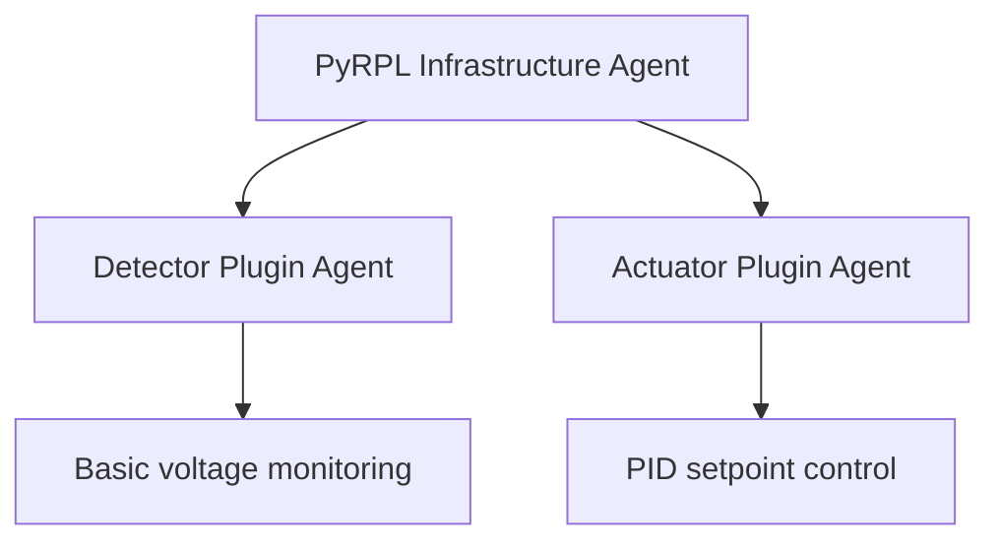
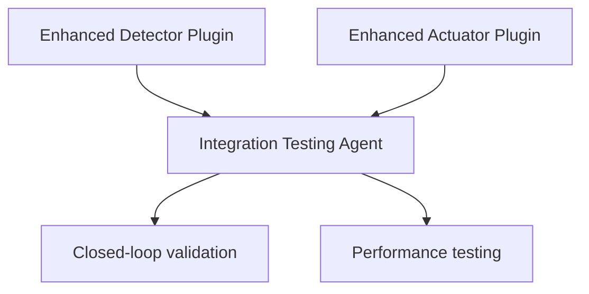
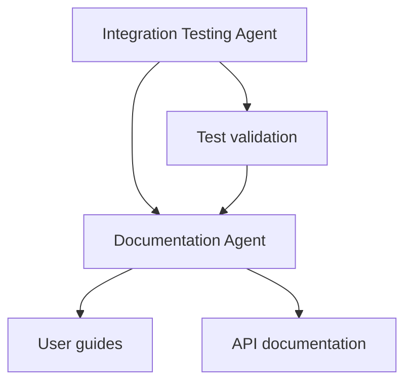

# PyMoDAQ-PyRPL Plugin Development Agents

## Overview

This directory contains specialized sub-agents designed to coordinate the development of the PyMoDAQ-PyRPL plugin integration. Each agent has specific expertise and responsibilities based on the phased implementation roadmap outlined in `ai_docs/RED_PITAYA_PYRPL_INTEGRATION_ARCHITECTURE.md`.

## Agent Structure

### 1. PyRPL Infrastructure Agent
**File:** `pyrpl_infrastructure_agent.md`  
**Role:** Lead Developer for core communication infrastructure  
**Primary Responsibility:** Task 1.1 - PyRPL Communication Wrapper

- Singleton pattern implementation for PyRPL connections
- Error handling and connection management
- Thread-safe operations and resource cleanup
- API design for plugin developers

### 2. Detector Plugin Agent
**File:** `detector_plugin_agent.md`  
**Role:** Developer A - 0D Detector Plugin Specialist  
**Primary Responsibilities:** Tasks 1.2, 2.2 - Detector Plugin Development

- Phase 1: Basic voltage monitoring from Red Pitaya scope
- Phase 2: Multi-channel monitoring (scope + PID output)
- Real-time data acquisition and PyMoDAQ integration
- Performance optimization for continuous monitoring

### 3. Actuator Plugin Agent
**File:** `actuator_plugin_agent.md`  
**Role:** Developer B - PID Actuator Plugin Specialist  
**Primary Responsibilities:** Tasks 1.3, 2.1 - PID Actuator Development

- Phase 1: Virtual actuator for PID setpoint control
- Phase 2: Full PID parameter control interface
- Safety features and voltage limiting
- Closed-loop feedback system implementation

### 4. Integration Testing Agent
**File:** `integration_testing_agent.md`  
**Role:** Testing Specialist  
**Primary Responsibilities:** Tasks 2.3, 3.1 - Testing and Validation

- Unit testing with mock PyRPL hardware
- Hardware-in-the-loop integration testing
- Performance benchmarking and validation
- Closed-loop system testing and CI/CD setup

### 5. Documentation Agent
**File:** `documentation_agent.md`  
**Role:** Documentation Specialist  
**Primary Responsibility:** Task 3.2 - Comprehensive Documentation

- User guides and installation instructions
- API reference and developer documentation
- Laser stabilization tutorials
- Troubleshooting guides and maintenance

## Development Phases and Agent Coordination

### Phase 1: Core Infrastructure (Week 1-2)
**Active Agents:** Infrastructure, Detector, Actuator  
**Goal:** Basic functionality and hardware communication

**Coordination Points:**
- Infrastructure Agent provides wrapper API requirements
- Detector and Actuator agents implement basic PyMoDAQ integration
- All agents coordinate on error handling and connection management

### Phase 2: Enhanced Features (Week 3-4)
**Active Agents:** All agents  
**Goal:** Full-featured plugins and initial integration

**Coordination Points:**
- Testing Agent validates multi-plugin coordination
- Enhanced features tested in realistic scenarios
- Performance benchmarks established

### Phase 3: Testing & Documentation (Week 5-6)
**Active Agents:** Testing, Documentation  
**Goal:** Production-ready plugin with comprehensive documentation

**Coordination Points:**
- Testing Agent provides validation for documentation examples
- Documentation Agent creates guides based on tested procedures
- All previous agents review documentation for technical accuracy

## Agent Communication Protocol

### Information Sharing
- **Technical Requirements:** Infrastructure Agent → Plugin Agents
- **API Specifications:** Infrastructure Agent → All Agents
- **Test Results:** Testing Agent → Documentation Agent
- **User Feedback:** Documentation Agent → Development Agents

### Decision Making
- **Architecture Decisions:** Led by Infrastructure Agent
- **Feature Prioritization:** Coordinated by Testing Agent
- **Documentation Standards:** Led by Documentation Agent
- **Integration Timeline:** Consensus among all agents

### Quality Assurance
- Each agent reviews deliverables from related agents
- Testing Agent validates all implementations
- Documentation Agent ensures technical accuracy
- Infrastructure Agent maintains architectural consistency

## Usage Guidelines

### For Project Managers
1. Assign specific agents to team members based on expertise
2. Use agent specifications for sprint planning and task allocation
3. Monitor inter-agent dependencies for critical path management
4. Coordinate agent communication for milestone reviews

### For Developers
1. Reference appropriate agent documentation for implementation details
2. Follow agent-specific testing requirements
3. Coordinate with related agents for integration points
4. Maintain agent deliverables according to specifications

### For Quality Assurance
1. Use agent success criteria for validation checkpoints
2. Validate inter-agent coordination and communication
3. Ensure agent deliverables meet project standards
4. Monitor agent performance against timeline expectations

## File Dependencies

Each agent references the following context files:
- `pymodaq_plugins_pyrpl/CLAUDE.md` - Technical implementation guide
- `ai_docs/RED_PITAYA_PYRPL_INTEGRATION_ARCHITECTURE.md` - Phased roadmap
- Agent-specific source files and test requirements

## Success Metrics

### Individual Agent Success
- Completion of assigned tasks according to specifications
- Quality deliverables meeting defined success criteria
- Adherence to timeline and coordination requirements

### Team Coordination Success
- Seamless integration between agent deliverables
- Effective communication and dependency management
- Successful completion of project milestones

### Project Success
- Functional PyMoDAQ-PyRPL plugin integration
- Comprehensive documentation and testing
- Production-ready laser stabilization capability

---

**Note:** These agents are designed to work within Claude-Code's sub-agent framework. Each agent should be invoked with appropriate context and coordination as outlined in their individual specifications.